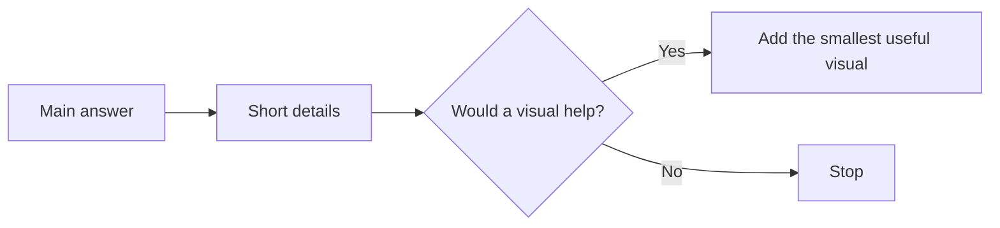

# like-im-5

Clear answers should not require expert reading skills.

`like-im-5` is an Agent Skill that makes AI output easier to scan, understand, and use. It starts with the big picture, uses plain English, keeps bullets short, and adds a visual only when the visual helps.

## At a glance

- Uses grade-8 English without talking down to the reader.
- Keeps needed technical words and explains them once.
- Works with Codex, Claude Code, Gemini CLI, Qwen Code, Kimi, Pi, and other Agent Skills tools.

## What changes

| Before | After |
| --- | --- |
| Long setup before the answer | Answer or result first |
| Dense paragraphs | Short headings and bullets |
| Jargon with no help | Needed terms explained once |
| Decorative diagrams | Small visuals that explain a real link |



The skill keeps the path from answer to action short.

## Use it

Ask for simple or accessible writing, or invoke the skill by name:

```text
$like-im-5 Explain how OAuth works.
$like-im-5 Rewrite this release note for a wider audience.
$like-im-5 Draft the pull request description for these changes.
```

Hosts that support model-invoked skills can also load it when a request asks for plain, concise, easy-to-scan, or visual writing.

See [INSTALL.md](INSTALL.md) for platform setup.

## Pull request format

```markdown
## Why

- What problem does this solve?
- Who or what does the problem affect?

## How

- What changed?
- What choices matter to the reviewer?

## Proof

- What tests, screenshots, or checks show it works?
```

## Develop

```bash
python3 scripts/run_evals.py validate
python3 -m unittest discover -s tests
```

The evaluation suite checks clarity without allowing correctness, safety, or required detail to get worse.

## Note

`like-im-5` is about broad reading access. It is not a medical tool or diagnosis.
